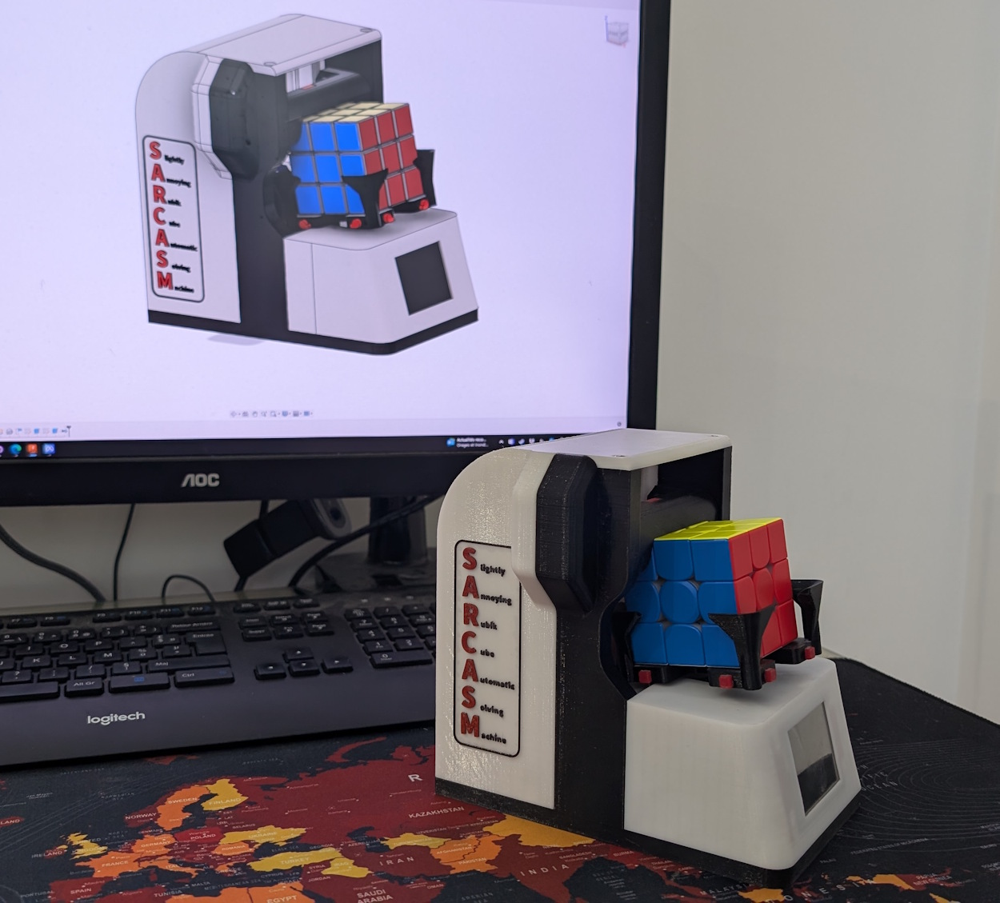

# S.A.R.C.A.S.M
**Slightly Annoying Rubik's Cube Automatic Solving Machine**

*S.A.R.C.A.S.M* is a 3D-printed, Teensy-powered robot that scans, solves, and sassily comments on a Rubik’s Cube.  

This repository contains the code and schematics of the build.

## Demo videos
- Short clip: https://youtube.com/shorts/Xer4mPZZH8E
- Full demo: https://youtu.be/WV52RtuWXk0

## Highlights
- Teensy 4.1 main controller + ESP32-CAM for image capture.
- ILI9341 display with custom 2D&3D graphics, animations, and lip-sync.
- Stepper + servos for cube handling with position sensors to detect faults.  
- RGBW lighting synchronized to audio.
- On-device TTS (espeak-ng) with a collection of sarcastic lines.
- ...

## Warning
This is a work in progress. The repo is currently in a very messy and incomplete state (and will most likely stay that way until I find some time to work on it...). Sorry ! 
